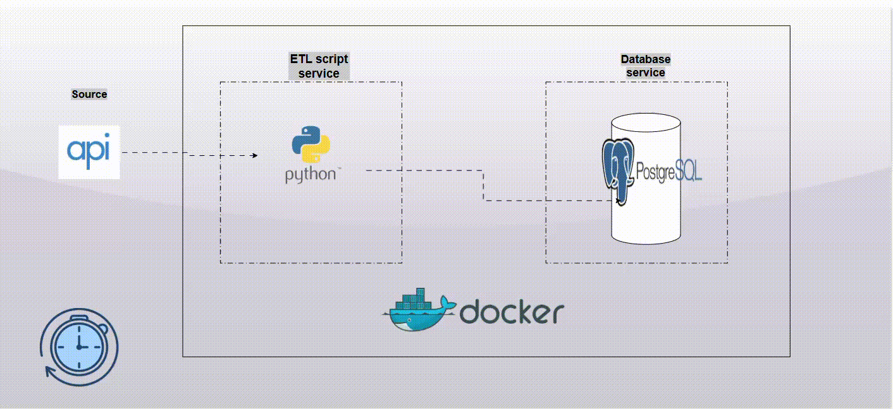

# 🧬 EL Pipeline with Docker Compose

A fully managed Extract–Load (EL) data pipeline built with Python and PostgreSQL, containerized with Docker Compose for seamless deployment and management.
This setup ensures secure credential handling, persistent storage, and automated scheduling for both data extraction and database backups.



## 🚀 Overview

1. This project automates the process of:

2. Extracting data via a Python script from a defined source (API, files, etc.).

3. Loading the transformed data into a PostgreSQL database.

4. Scheduling pipeline runs and database backups using cron jobs.

5. Securing credentials and ensuring data persistence across container restarts.

The entire system runs on the same server within isolated Docker containers, orchestrated through Docker Compose.

```bash
FARM_NEWS/
│
├── .venv/                     # Your virtual environment (auto-generated)
│
├── dev/                       # Development environment folder
│   ├── logs/
│   ├── utils/
│   └── .env                   # Dev-specific environment variables
│
├── prod/                      # Production environment folder
│   ├── credentials/
│   ├── logs/
│   ├── utils/
│   └── docker-compose.yml     # Likely prod deployment setup
│
├── app.ipynb                  # Notebook (for experimentation)
├── app.py                     # Main application / entrypoint script
├── here.csv                   # Local test data file
├── ingestion.log              # Log file (runtime generated)
├── query.sql                  # SQL scripts for extraction or transformation
├── requirements.txt           # Dependencies
├── .gitignore
└── README.md

```
## 🛠️ Key Features
### 🔒 Secure Credential Management

Credentials are handled using Docker secrets, not environment variables.

This keeps sensitive information (e.g., database password, API keys) off container logs and images.


### 💾 Data Persistence

Docker volumes ensure PostgreSQL and pipeline data persist between container restarts.

Database data and extracted results are never lost when containers are recreated.


### 📂 Bind Mounts for Logs & Backups

Python script logs are written to a host-mounted directory (./logs).

PostgreSQL backups are stored in a bind-mounted folder (./backups) for easy external access.


### ⏰ Automated Scheduling

A cron service triggers:

Daily pipeline runs to refresh the database.

Twice-daily PostgreSQL backups for data safety.

Each job runs inside its respective container with predefined intervals.